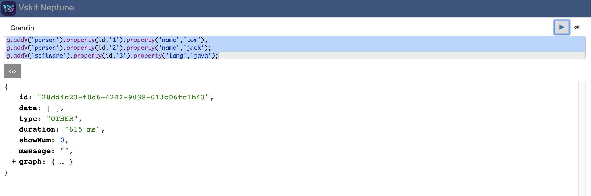
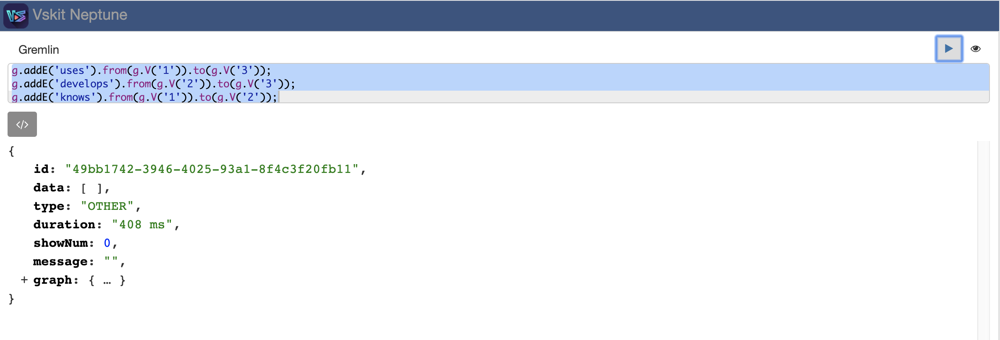
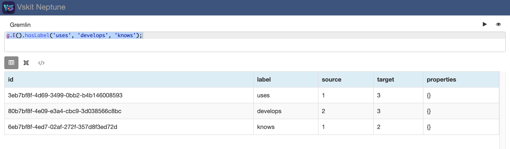
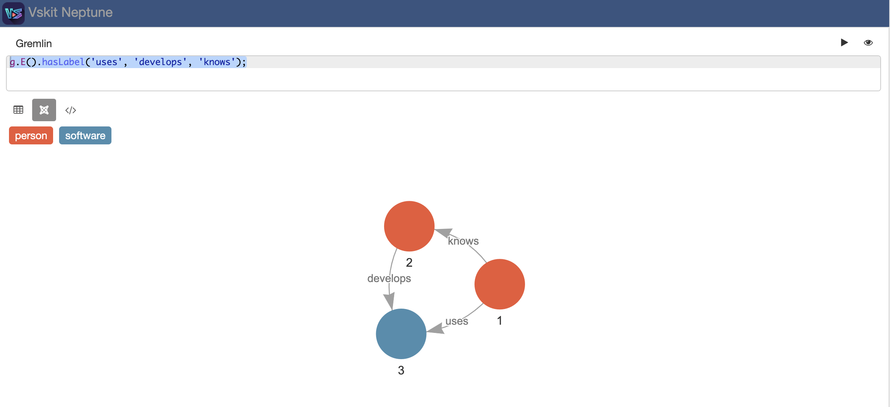
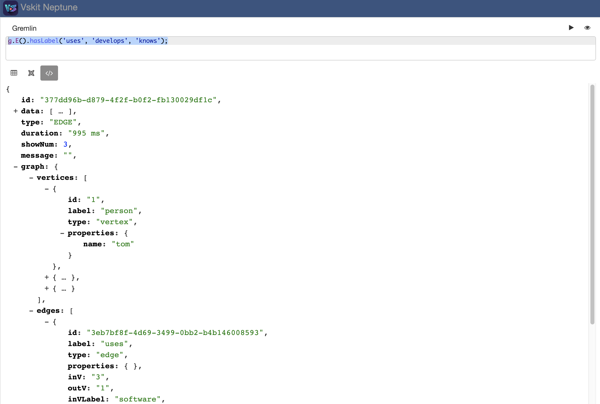

# Neptune Console

## 简介

整合百度开源Huge Graph的前端模块实现Aws Neptune图数据库的可视化操作控制台

- neptune-console-api：neptune操作控制台API
- neptune-console-dao-starter：neptune数据访问层封装
- neptune-console-ui：neptune操作可视化前端

## 特性

* 通过顶点和边绘制图形
* 显示顶点、边和模式的数据详细信息
* 提供语法突出显示、智能代码完成的智能Gremlin编辑器

## 源码构建

* 源码下载：

```bash
git clone https://github.com/transsnet/neptune-console.git
# 或者
git clone git@github.com:transsnet/neptune-console.git
```

* 进入项目根目录 `neptune-console`
* 安装前端依赖：

```bash
cd neptune-console-ui
npm install
```

* 构建：回到项目根目录执行`build.sh`脚本

```bash
./build.sh
```

```xml
...
[INFO] --- spring-boot-maven-plugin:2.1.5.RELEASE:repackage (repackage) @ neptune-console-api ---
[INFO] Replacing main artifact with repackaged archive
[INFO] ------------------------------------------------------------------------
[INFO] Reactor Summary:
[INFO] 
[INFO] neptune-console 0.0.1 .............................. SUCCESS [  0.314 s]
[INFO] neptune-console-dao-starter 1.0.0 .................. SUCCESS [  3.535 s]
[INFO] neptune-console-api 1.0.0 .......................... SUCCESS [  4.780 s]
[INFO] ------------------------------------------------------------------------
[INFO] BUILD SUCCESS
[INFO] ------------------------------------------------------------------------
[INFO] Total time:  8.901 s
[INFO] Finished at: 2020-01-09T14:17:48+08:00
[INFO] ------------------------------------------------------------------------
```

* 启动运行：项目根目录执行`start.sh`脚本

```bash
./start.sh
```

```xml
...
14:18:40 [main] INFO  o.s.s.concurrent.ThreadPoolTaskExecutor - Initializing ExecutorService 'applicationTaskExecutor'
14:18:40 [main] INFO  o.s.b.a.w.s.WelcomePageHandlerMapping - Adding welcome page: class path resource [static/index.html]
14:18:40 [main] INFO  s.d.s.w.p.DocumentationPluginsBootstrapper - Context refreshed
14:18:40 [main] INFO  s.d.s.w.p.DocumentationPluginsBootstrapper - Found 1 custom documentation plugin(s)
14:18:40 [main] INFO  s.d.s.w.s.ApiListingReferenceScanner - Scanning for api listing references
14:18:41 [main] INFO  o.s.b.w.embedded.tomcat.TomcatWebServer - Tomcat started on port(s): 9999 (http) with context path ''
14:18:41 [main] INFO  c.t.v.n.VskitNeptuneConsoleApplication - Started VskitNeptuneConsoleApplication in 3.374 seconds (JVM running for 3.751)
14:18:41 [main] INFO  c.t.v.n.VskitNeptuneConsoleApplication - App running at:
14:18:41 [main] INFO  c.t.v.n.VskitNeptuneConsoleApplication - ==>> http://localhost:9999/index.html
```

* 访问：[http://localhost:9999/index.html](http://localhost:9999/index.html)


## 使用Gremlin语言创建一个图

* 创建顶点

```java
g.addV('person').property(id,'1').property('name','tom');
g.addV('person').property(id,'2').property('name','jack');
g.addV('software').property(id,'3').property('lang','java');
```



* 创建边

```java
g.addE('uses').from(g.V('1')).to(g.V('3'));
g.addE('develops').from(g.V('2')).to(g.V('3'));
g.addE('knows').from(g.V('1')).to(g.V('2'));
```



* 查询

```java
g.E().hasLabel('uses', 'develops', 'knows');
```





